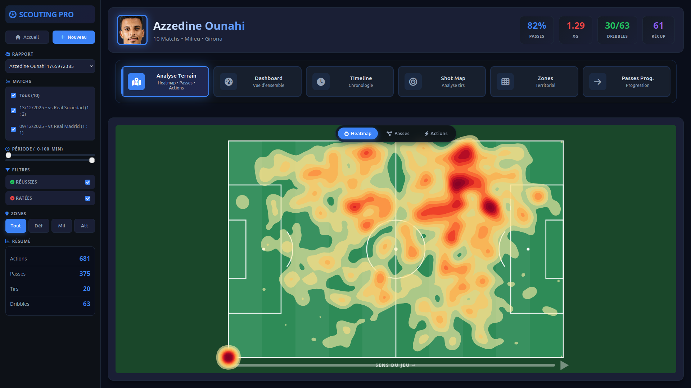

# Football Scouting Reports - Interactive Data Visualization

**Master 2 Intelligence Artificielle** | Université Claude Bernard Lyon 1 | 2025-2026

[](https://scouting-reports-dataviz.onrender.com/)

## English Summary

Interactive football scouting platform that automatically scrapes player performance data from WhoScored and provides advanced visualizations including pass networks, heatmaps, shot maps with xG calculation, radar charts, and progressive pass analysis. The system enables professional-grade player evaluation through dynamic filtering and multi-match analysis, serving scouts, tactical analysts, and coaching staff.

## Description du Projet

Plateforme web interactive dédiée à l'analyse avancée de performances de joueurs de football. Le système intègre un module de scraping automatique des données événementielles depuis WhoScored, suivi d'une suite complète de visualisations interactives permettant d'explorer en profondeur les statistiques techniques, tactiques et physiques des joueurs.

### Problématique Abordée

L'analyse de performances footballistiques nécessite le traitement de volumes importants de données événementielles (passes, tirs, duels, actions défensives). Les outils actuels présentent plusieurs limitations :

- Données dispersées et non-standardisées entre différentes sources
- Outils d'analyse professionnels coûteux et peu accessibles
- Processus de collecte manuel chronophage
- Visualisations statiques offrant peu d'interactivité
- Difficulté à analyser plusieurs matchs simultanément

Notre solution propose une plateforme unifiée intégrant scraping automatique et visualisations interactives personnalisables, permettant une analyse complète et accessible des performances individuelles.

## Public Cible

### Utilisateurs Principaux

**Recruteurs et Scouts Professionnels**

- Identification rapide des profils de joueurs
- Évaluation multi-critères pour le recrutement
- Comparaison de performances entre matchs

**Analystes Tactiques**

- Étude approfondie des patterns de jeu
- Analyse post-match détaillée
- Préparation d'adversaires

**Staff Technique et Entraîneurs**

- Suivi du développement des joueurs
- Feedback objectif basé sur les données
- Planification tactique informée

### Trois Tâches Essentielles

**1. Évaluer le profil technique global d'un joueur**

- Dashboard multi-métriques avec graphique radar
- Vue d'ensemble des forces et faiblesses
- Statistiques détaillées par catégorie (passes, tirs, défense)

**2. Analyser la qualité et la créativité de la distribution**

- Carte de passes interactive avec filtres
- Identification des passes clés et décisives
- Analyse de la précision par zone du terrain

**3. Mesurer l'efficacité offensive et la dangerosité**

- Shot map avec calcul d'Expected Goals (xG)
- Visualisation des zones de danger
- Analyse des passes progressives cassant les lignes

Ces trois tâches couvrent les dimensions fondamentales de l'évaluation moderne : profil technique, contribution au jeu collectif, et impact offensif mesurable.

## Sources de Données

### Source Principale : WhoScored

**Avantages**

- Données événementielles avec coordonnées XY précises (0-100%)
- Qualifiers détaillés pour chaque action (type de passe, zone, outcome)
- Couverture extensive : 50+ compétitions internationales
- Mise à jour quasi temps réel des statistiques

**Limitations et Solutions**

- Absence d'API officielle publique → Scraping via Playwright avec parsing robuste
- Structure HTML susceptible de changements → Sélecteurs CSS flexibles et fallbacks
- Rate limiting et protection anti-bot → Délais adaptatifs et headers randomisés

### Plan de Secours

En cas d'indisponibilité temporaire de WhoScored :

1. **Données en cache** : Utilisation des fichiers JSON locaux pré-collectés (5 joueurs, 30+ matchs)
2. **StatsBomb Open Data** : Conversion au format du projet pour datasets alternatifs
3. **Mock Data** : Génération de données synthétiques réalistes pour démonstration

**Datasets Pré-collectés Disponibles**

- Lamine Yamal (FC Barcelone) - 5 matchs
- Matheus Cunha (Wolverhampton) - Saison complète
- Rayan Cherki (Olympique Lyonnais) - 10 matchs
- Jérémy Doku (Manchester City) - 6 matchs
- Azzedine Ounahi (Panathinaikos) - 8 matchs

## Travaux Connexes

### 1. Friends of Tracking - Pass Networks & Event Data

**Lien:** [https://github.com/Friends-of-Tracking-Data-FoTD](https://github.com/Friends-of-Tracking-Data-FoTD)

**Intérêt pour notre projet**

- Méthodologie scientifique éprouvée pour l'analyse de réseaux de passes
- Visualisations de référence dans la communauté de l'analytics football
- Approche pédagogique avec tutoriels détaillés

**Améliorations apportées**

- Interface web interactive vs notebooks Jupyter statiques
- Système de filtrage multi-critères en temps réel
- Scraping automatisé intégré sans manipulation manuelle de fichiers
- Support multi-match avec agrégation intelligente

### 2. StatsBomb Visualization Library

**Lien:** [https://github.com/statsbomb/statsbombpy](https://github.com/statsbomb/statsbombpy)

**Intérêt pour notre projet**

- Qualité visuelle professionnelle (pizza charts, shot maps)
- Standard industriel reconnu par les clubs professionnels
- Documentation exhaustive et bonnes pratiques

**Améliorations apportées**

- Plateforme web unifiée vs bibliothèque Python nécessitant code
- Pas de dépendance à une API payante ou authentification
- Personnalisation complète de l'interface et des filtres
- Intégration du scraping pour autonomie totale

### 3. Understat - Expected Goals Model

**Lien:** [https://understat.com/](https://understat.com/)

**Intérêt pour notre projet**

- Modèle xG avancé basé sur machine learning
- Visualisations claires et intuitives des zones de danger
- Large historique de données pour benchmarking

**Améliorations apportées**

- Calcul xG en temps réel intégré aux visualisations
- Combinaison xG avec analyse de passes et mouvement
- Gradient visuel de dangerosité plus expressif
- Analyse granulaire par match et non seulement agrégée

## Architecture Technique

### Structure du Projet

```

Scouting_Reports_DataViz/
│
├── index.html # Interface principale
├── main.py # Serveur HTTP + API REST
├── README.md # Documentation
├── avancement.txt # Cahier de bord
│
├── data/ # Cache JSON (gitignored)
│ └── \*.json
│
├── scraper/
│ ├── whoscored_scraper.py # Module de scraping WhoScored
│ ├── image_scraper.py # Récupération photos joueurs
│ ├── requirements.txt # Dépendances Python
│ └── **init**.py
│
└── src/
├── css/
│ └── style.css # Styles modernes (Glassmorphism)
│
└── js/
├── main.js # Orchestrateur principal
├── dataManager.js # Gestion des données + traduction FR
├── pitch.js # Moteur géométrique SVG
├── dashboard.js # Vue d'ensemble multi-métriques
├── passmap.js # Réseau de passes interactif
├── shotmap.js # Carte des tirs + xG
├── heatmap.js # Densité de présence
├── radarChart.js # Profil radar performance
├── progressivePasses.js # Analyse passes progressives
├── timeline.js # Timeline temporelle
├── zoneAnalysis.js # Statistiques par zone
├── actions.js # Gestion des événements
└── defensiveActions.js # Module défensif (en développement)

```

### Stack Technique

**Frontend**

- HTML5, CSS3 (design Glassmorphism, animations fluides)
- JavaScript ES6+ (Vanilla, architecture modulaire)
- D3.js v7 pour les visualisations SVG
- Responsive design (mobile, tablette, desktop)

**Backend**

- Python 3.11 (http.server pour serveur local)
- API REST pour communication frontend/scraper
- Gestion asynchrone avec asyncio

**Scraping**

- Playwright pour navigation browser automatisée
- BeautifulSoup4 pour parsing HTML
- Regex pour extraction de données structurées

**Déploiement**

- Render pour hébergement production
- GitHub pour versioning et collaboration
- GitHub Pages (alternative déploiement statique)

## Fonctionnalités

### Visualisations Implémentées

**1. Dashboard Multi-Métriques**

- Vue d'ensemble complète avec graphique radar à 6 axes
- Statistiques détaillées (passes, tirs, dribbles, défense)
- Mise en page moderne en grille responsive

**2. Pass Map Interactive**

- Réseau complet de passes avec trajectoires directionnelles
- Filtres : passes clés, réussies, ratées
- Tooltips détaillés au survol (distance, minute, qualifiers)
- Animation d'entrée progressive

**3. Shot Map avec xG**

- Carte des tirs avec gradient de dangerosité
- Calcul d'Expected Goals basé sur position et contexte
- Visualisation des buts vs occasions manquées
- Zones de danger identifiées

**4. Heatmap de Présence**

- Densité de touches de balle par zone
- Contours fluides générés par D3.contourDensity
- Identification du positionnement moyen
- Overlay sur terrain réaliste

**5. Passes Progressives**

- Détection des passes cassant les lignes défensives
- Distinction visuelle (standard vs pénétration dernier tiers)
- Calcul automatique de la progression territoriale
- Statistiques de gain de terrain

**6. Timeline Temporelle**

- Distribution des actions par minute de jeu
- Identification des périodes d'intensité
- Filtrage dynamique par tranche horaire

**7. Zone Analysis**

- Répartition des actions par tiers de terrain
- Statistiques offensives vs défensives par zone
- Analyse de la couverture du terrain

### Filtres Dynamiques

- Sélection de match(s) spécifique(s) ou vue agrégée
- Période de jeu (slider 0-90+ minutes)
- Type d'action (succès/échec)
- Zone du terrain (défensive/médiane/offensive)
- Mise à jour temps réel de toutes les visualisations

## Installation et Utilisation

### Prérequis

```bash
Python 3.8 ou supérieur
pip (gestionnaire de paquets Python)
Navigateur moderne (Chrome, Firefox, Edge)
```

### Installation

```bash
# Cloner le repository
git clone https://github.com/[USERNAME]/Scouting_Reports_DataViz.git
cd Scouting_Reports_DataViz

# Installer les dépendances Python
pip install -r scraper/requirements.txt

# Lancer le serveur local
python main.py
```

Le dashboard s'ouvre automatiquement sur `http://localhost:8000`

### Utilisation

**Option 1 : Scraper un nouveau joueur**

1. Copier l'URL d'un profil joueur WhoScored (match ou saison)
2. Entrer le nom exact du joueur
3. Cliquer sur "Scraper" et attendre 10-30 secondes
4. Les données sont automatiquement chargées et visualisées

**Option 2 : Charger un fichier existant**

1. Sélectionner un fichier JSON dans le menu déroulant
2. Les visualisations se mettent à jour instantanément

**Exploration Interactive**

- Naviguer entre les 7 visualisations via le menu
- Ajuster les filtres pour affiner l'analyse
- Survoler les éléments pour obtenir des détails
- Exporter les insights pour rapports

## Organisation du Travail

### Équipe de Développement

| Membre       | Rôle Principal             | Modules Responsables                                                    |
| ------------ | -------------------------- | ----------------------------------------------------------------------- |
| **Amine**    | Backend & Data Pipeline    | Scraper WhoScored, Image Scraper, API REST, Data Manager, Pitch.js      |
| **Youssef**  | Frontend & UI/UX           | Interface HTML/CSS, Design Glassmorphism, Layout Responsive, Animations |
| **Amir**     | Visualizations Specialist  | Pass Map, Shot Map, Heatmap, Progressive Passes, Dashboard, Radar Chart |
| **Joubrane** | DevOps & Quality Assurance | Timeline, Zone Analysis, Tests, Déploiement Render, Documentation       |

### Méthodologie

**Communication**

- GitHub Projects pour gestion des tâches (Issues, Pull Requests)
- Discord pour communication quotidienne
- Google Drive pour documentation partagée

**Sessions de Travail**

- Mardis 14h-16h : Développement collaboratif
- Jeudis 18h-20h : Code review et tests d'intégration
- Dimanches matin : Intégration et préparation déploiements

**Workflow Git**

- Branches feature pour chaque module
- Pull Requests avec review obligatoire
- Conventions de commit : feat/fix/docs/style/refactor/test
- Protection de la branche main

### Répartition des Contributions

```
Backend & Scraping (Amine)           : 25%
Frontend & Design (Youssef)          : 25%
Visualisations D3.js (Amir)          : 25%
DevOps & Documentation (Joubrane)    : 25%
```

---

## Roadmap

### Version 1.0 - Soutenance (13/01/2026)

- Système de scraping fonctionnel et robuste
- 7 visualisations interactives complètes
- Filtres multi-critères opérationnels
- Interface responsive et moderne
- Déploiement production sur Render
- Documentation exhaustive

### Version 1.5 - Post-Soutenance (Q1 2026)

- Module Actions Défensives détaillé
- Comparaison côte-à-côte multi-joueurs
- Export PDF des rapports personnalisés
- Thèmes de couleurs personnalisables
- Système de favoris et bookmarks

### Version 2.0 - Future (Q2 2026)

- Replay animé des actions (timeline playback)
- Suggestions ML par similarité de profil
- Analyse de tendances multi-saisons
- API publique pour développeurs externes
- Application mobile native

---

## Limitations et Perspectives

### Limitations Actuelles

**Données**

- Dépendance à la structure HTML de WhoScored (scraping fragile)
- Couverture limitée aux compétitions présentes sur la plateforme
- Pas d'accès aux données de tracking physique (GPS, vitesse)

**Fonctionnalités**

- Module Actions Défensives non finalisé
- Absence de comparaison directe entre joueurs
- Export limité (pas de PDF automatique)

**Performance**

- Temps de scraping variable (10-30s selon match)
- Visualisations lourdes sur datasets volumineux (100+ matchs)
- Pas de mise en cache navigateur optimisée

### Perspectives d'Amélioration

**Court Terme**

- Optimisation du parsing HTML avec sélecteurs plus robustes
- Implémentation cache Redis pour accélérer chargements
- Ajout d'indicateurs de progression durant scraping

**Moyen Terme**

- Intégration de sources de données complémentaires (Opta, StatsBomb)
- Système de notifications pour nouveaux matchs scrapés
- Mode hors-ligne avec Service Workers

**Long Terme**

- Modèle ML pour prédiction de performances futures
- Plateforme collaborative avec annotations partagées
- Monétisation via abonnements pour clubs amateurs

## Contexte Académique

**Université Claude Bernard Lyon 1**  
Master 2 Intelligence Artificielle  
UE : Visualisation Interactive de Données  
Année Universitaire : 2025-2026

**Lien vers le cours :** [http://masters.sif.univ-lyon1.fr/visualisation](http://masters.sif.univ-lyon1.fr/visualisation)

### Notation

| Critère                       | Pondération |
| ----------------------------- | ----------- |
| Veille individuelle           | 5%          |
| Cadrage, suivi, peer-review   | 15%         |
| Présentation et démonstration | 40%         |
| Réalisation technique         | 40%         |

### Jalons Respectés

- 05/11 : Lancement du projet
- 12/11 : Constitution du groupe (4 membres)
- 09/12 : Repository GitHub et document de cadrage
- 16/12 & 06/01 : TPs banalisés avec retours
- 13/01 : Soutenance (10 minutes)
- 23/01 : Rendu final

## Crédits et Licence

### Sources de Données

**WhoScored** ([https://www.whoscored.com/](https://www.whoscored.com/))  
Données événementielles utilisées dans un cadre strictement éducatif et académique.

**Photos Joueurs**  
Sources publiques via APIs tierces (usage éducatif).

### Inspirations Techniques

- **D3.js Gallery** : Patterns de visualisation avancés
- **Friends of Tracking** : Méthodologie d'analyse football
- **FC Python** : Techniques de traitement de données sportives
- **Soccermatics** : Approche scientifique de l'analytics

### Design et Ressources

- **Glassmorphism.com** : Inspiration design interface moderne
- **Font Awesome** : Bibliothèque d'icônes
- **Google Fonts** (Inter) : Police de caractères

### Licence

Ce projet est réalisé dans un cadre académique à l'Université Claude Bernard Lyon 1.  
Le code source est disponible sous licence MIT pour usage éducatif.

Les données appartiennent à leurs propriétaires respectifs et sont utilisées conformément aux conditions d'utilisation de WhoScored pour un usage non-commercial et éducatif.

## Contact

**Équipe de Développement**

- **Amine** - Backend & Data
- **Youssef** - Frontend & Design
- **Amir** - Visualizations
- **Joubrane** - DevOps & QA

**Formation**  
Master 2 Intelligence Artificielle  
Université Claude Bernard Lyon 1  
2025-2026

**Repository GitHub**  
[https://github.com/[USERNAME]/Scouting_Reports_DataViz](https://github.com/[USERNAME]/Scouting_Reports_DataViz)

**Démo Live**  
[https://scouting-reports-dataviz.onrender.com/](https://scouting-reports-dataviz.onrender.com/)

**Dernière mise à jour :** Janvier 2026
